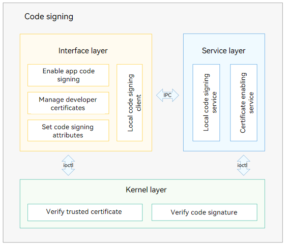

# Code Signature

## Introduction

The code signature component implements the code signing mechanism of OpenHarmony, which provides validity check and integrity protection for apps in runtime, eliminating execution of malicious code on devices and malicious tampering of app code by attackers.

Architecture of the code signature component



The code signature component provides the following functions:

- Trusted certificate management: imports the device certificate and local code signing certificate and validates the certificate chain and its trusted source.
- Code signing enabling: provides APIs in user mode to enable code signing of apps or code files during installation.
- Local code signing: runs the signing service on the device and provides interfaces to sign local code (e.g. native code generated by the AOT).
- Code attribute setting: provides APIs for setting the code owner ID and initializing the XPM region.

## Directory Structure

```
/base/security/code_signature
├── interfaces                   # Interface layer
│   └── innerkits                #
│       ├── code_sign_attr_utils # APIs for setting code signing attributes
│       ├── code_sign_utils      # APIs for enabling code signing
│       ├── common               # Common basic capacities
│       └── local_code_sign      # APIs for local code signing
├── services                     # Service layer
│    ├── key_enable              # Certificate initialization
│    └── local_code_sign         # Local code signing service
├── test                         # Test cases
│    ├── fuzztest                # Fuzz test cases
│    └── unittest                # Unit test cases
└── utils                        # Common basic capabilities
```

## Usage
### Available APIs

| **API**| **Description**|
| --- | --- |
| int32_t EnforceCodeSignForApp(const EntryMap &entryPath, const std::string &signatureFile); | Enforces code signing for HAPs.|
| int32_t EnforceCodeSignForApp(const std::string &path, const EntryMap &entryPathMap, FileType type); | Enforces code signing for HAPs.|
| int32_t EnforceCodeSignForFile(const std::string &path, const ByteBuffer &signature); | Enforces code signing for files.|
| int32_t EnforceCodeSignForAppWithOwnerId(std::string ownerId, const std::string &path, const EntryMap &entryPathMap, FileType type); | Enforces code signing for HAPs with the owner ID.|
| int ParseOwnerIdFromSignature(const ByteBuffer &sigbuffer, std::string &ownerID); | Parses the owner ID from the signature.|
| int32_t EnableKeyInProfile(const std::string &bundleName, const ByteBuffer &profileBuffer); | Trusts a developer certificate.|
| int32_t RemoveKeyInProfile(const std::string &bundleName); | Revokes a trusted developer certificate.|
| int32_t InitLocalCertificate(ByteBuffer &cert); | Initializes a local code signing certificate.|
| int32_t SignLocalCode(const std::string &filePath, ByteBuffer &signature); | Signs the local code.|
| int32_t SignLocalCode(const std::string &ownerID, const std::string &filePath, ByteBuffer &signature); | Signs the local code with the owner ID.|
| int InitXpmRegion(void); | Initializes the XPM region.|
| int SetXpmOwnerId(uint32_t idType, const char *ownerId); | Sets an owner ID.|

### Usage Guidelines

[hapsigner User Guide](https://gitee.com/openharmony/developtools_hapsigner/blob/master/README.md)

## Repositories Involved

**[developtools\_hapsigner](https://gitee.com/openharmony/developtools_hapsigner/blob/master/README.md)**

**[kernel_linux_common_modules](https://gitee.com/openharmony/kernel_linux_common_modules)**

**[third\_party\_fsverity-utils](https://gitee.com/openharmony/third_party_fsverity-utils/blob/master/README.md)**
