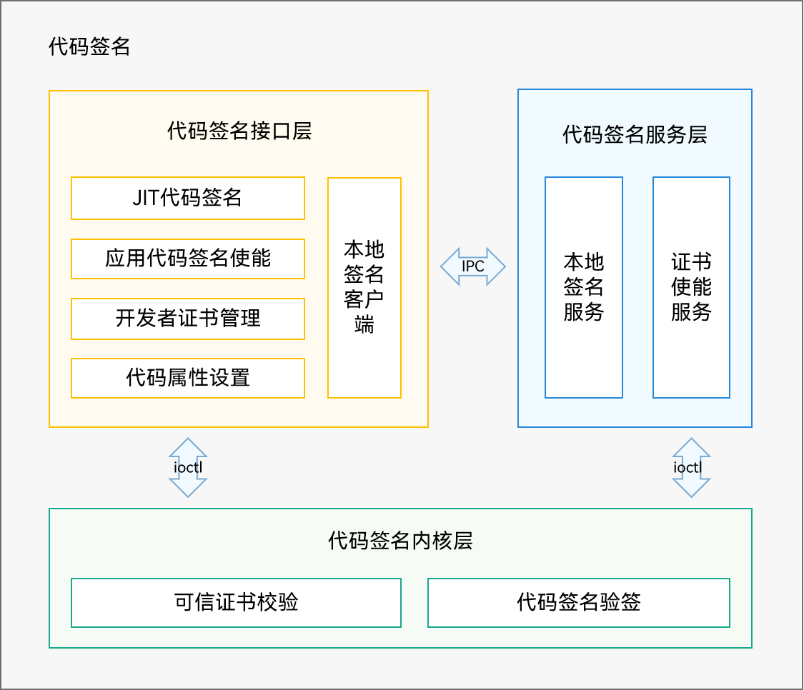

# 代码签名

## 简介

代码签名部件用于支持OpenHarmony的代码签名机制。OpenHarmony使用代码签名提供运行时应用程序的完整性保护，校验应用来源的合法性。

代码签名部件架构图



代码签名部件主要提供如下模块功能：

- 可信证书管理：将设备证书和本地签名证书写入内核.fs-verity keyring，支持证书链及其合法路径校验。
- 代码签名使能：在用户态提供代码签名校验的相关接口和逻辑，供应用安装的时候调用，为应用和代码文件使能代码签名。
- 本地代码签名：在设备侧运行签名服务给本地代码提供签名接口，为AOT生成的机器码文件生成代码签名。
- 代码属性设置：支持代码所有者标记及校验，提供配置XPM验签地址区接口。

## 目录

```
/base/security/code_signature
├── interfaces                   # 接口层
│   └── innerkits                #
│       ├── code_sign_attr_utils # 属性设置接口
│       ├── code_sign_utils      # 使能接口
│       ├── common               # 公共基础能力
│       └── local_code_sign      # 本地签名接口
├── services                     # 服务层
│    ├── key_enable              # 证书初始化
│    └── local_code_sign         # 本地签名服务
├── test                         # 测试用例
│    ├── fuzztest                # fuzz测试用例
│    └── unittest                # 单元测试用例
└── utils                        # 公共基础能力
```

## 使用
### 接口说明

| **接口声明** | **接口描述** |
| --- | --- |
| int32_t EnforceCodeSignForApp(const EntryMap &entryPath, const std::string &signatureFile); | 对hap使能代码签名 |
| int32_t EnforceCodeSignForApp(const std::string &path, const EntryMap &entryPathMap, FileType type); | 对hap使能代码签名 |
| int32_t EnforceCodeSignForFile(const std::string &path, const ByteBuffer &signature); | 对文件使能代码签名 |
| int32_t EnforceCodeSignForAppWithOwnerId(std::string ownerId, const std::string &path, const EntryMap &entryPathMap, FileType type); | 对hap使能代码签名和OwnerId校验 |
| int ParseOwnerIdFromSignature(const ByteBuffer &sigbuffer, std::string &ownerID); | 从签名中解析OwnerId |
| int32_t EnableKeyInProfile(const std::string &bundleName, const ByteBuffer &profileBuffer); | 信任开发者证书 |
| int32_t RemoveKeyInProfile(const std::string &bundleName); | 撤销已信任的开发者证书 |
| int32_t InitLocalCertificate(ByteBuffer &cert); | 初始化本地签名证书 |
| int32_t SignLocalCode(const std::string &filePath, ByteBuffer &signature); | 本地代码签名 |
| int32_t SignLocalCode(const std::string &ownerID, const std::string &filePath, ByteBuffer &signature); | 带OwnerId的本地代码签名 |
| int InitXpmRegion(void); | 初始化XPM地址 |
| int SetXpmOwnerId(uint32_t idType, const char *ownerId); | 设置OwnerId |

### 签名工具使用指南

**[使用指南](https://gitee.com/openharmony/developtools_hapsigner/blob/master/README_ZH.md)**

## 相关仓

**[developtools\_hapsigner](https://gitee.com/openharmony/developtools_hapsigner/blob/master/README_ZH.md)**

**[kernel_linux_common_modules](https://gitee.com/openharmony/kernel_linux_common_modules)**

**[third\_party\_fsverity-utils](https://gitee.com/openharmony/third_party_fsverity-utils/blob/master/README_zh.md)**
